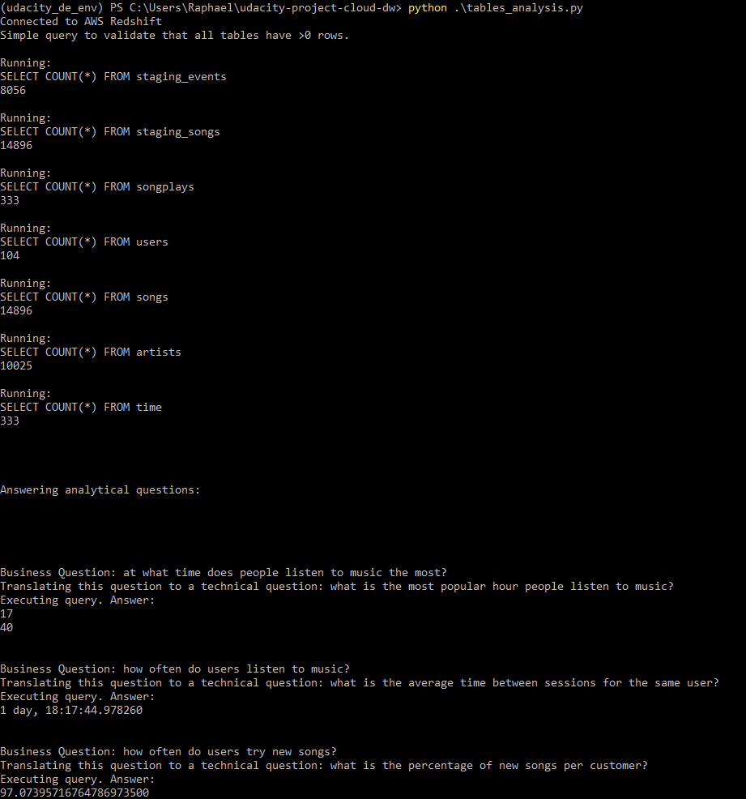

# udacity-project-cloud-dw
This repository hosts my Udacity's Data Engineering Nanodegree Cloud Data Warehouse Project.

Besides setting up the tables, I also included a file of table analysis, which include some queries that answer business questions. Please take a look.

Answer of the Analytical Questions:
